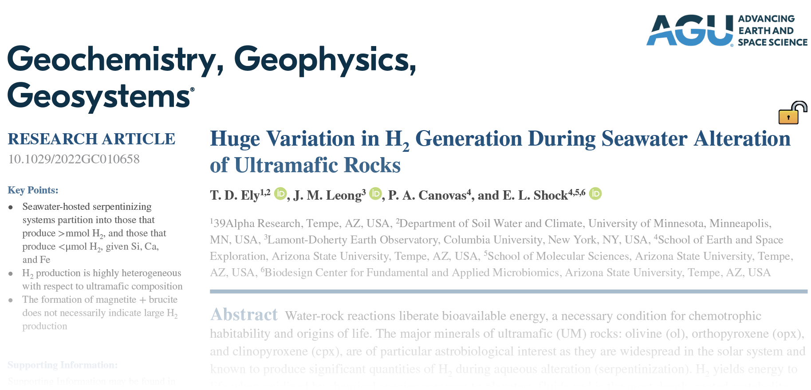

At 39 Alpha, we are more than just a team of geochemists, physicists, and software developers. We are passionate problem solvers, dedicated to making a meaningful impact on the world by conducting oiriginal scientific research that has a posative inpact on the enviornment, and by extension, humanity. This is why 39Alpha's [Team 0](/team) is developing novel research methods to aid in the discovery of mineral-based hydrogen generation techniqes.

When water interacts with rocks and mienrals in the environemnt, dihydrogen (H2) can be generated. But only sometimes, and only under certian conditions. Some of these minerals and conditions are known[^1][^2]. A recent publication on exactly this topic was published by 39Alpha team member Tucekr Ely[^3], alongside coauthoers, [James Leong](https://scholar.google.com/citations?user=Ma72boEAAAAJ&hl=en), [Peter Conovas](https://scholar.google.com/citations?user=Keg4MF4AAAAJ&hl=en), and [Everett Shock](https://scholar.google.com/citations?user=KDZS9jgAAAAJ&hl=en). Ultramafic rocks (cobination of the mineral solid solutions olivine, orthopyroxene, and clinopyroxene) are known to generate H2. Tuckers latest work applys novel high throughput modeling techniques to 
explore how smooth variation in the compostion of ultramafic rocks causes severeve variation H2 generation.

However, a massive diversity of mienrals and groups of minerals occur in nature, in contact with an endless array of fluids across a range of temperatures and pressures. Team0 is currently exploreing an expansion of the techniques used in Ely et al., 2022[^3] to discover unrealized minerals, mineral combinations, fluid conditions that might yield accessible hydrogen. Where might such systems be found in nature? Are they accessible? Can we capture them at a sufficiently low cost and carbon footprint to motivate their extraction?

A sufficiently lubricated debate amongst the team recently led to an expansion on this idea . . .
A nearly endless array of minerals, mineral combinations, and lab-derived fluids can be included within engineered environments. Which would be optimal, and under what conditions, if your goal was to generate hydrogen economically, and with a minimal carbon footprint?

If you are intersted in funding Team0 to explore this idea, or others like it, please reach out to [us](link), 

With our scientifically diverse skill set and extensive experience modeling geologic H2 generation, we bring a unique perspective to any collaborative research project. We specialize in providing high-throughput equilibrium and out-of-equilibrium geochemical modeles, enabling us to guide engineers in discovering optimal water-rock system for H2 generation. By analyzing and interpreting chemical models that span large ranges of the dependent variable space, we can identify the right conditions for hydrogen generation that should be tested further in laborary settints, and a process that would traditionally be time-consuming and expensive in the lab or the field.

Team 0 has the ability to test hypotheses and develop novel modeling and statistical packages with remarkable speed and efficiency. Our expertise in model and tool building allows us to quickly assess chemical and economic aspects. By rapidly ruling out possible generation methods, we can help engineering teams navigate the most promising avenues with precision and confidence.

... in progress ...

As we compete for the prestigious ARPA-E grant focused on Geologic Hydrogen, we firmly believe that we are the ideal fit to help address this critical challenge.

designing a research porject that will calucalate which naturally occurming mienrals generate H2 and under which conditions. 

Similar work, recently published by Team0 member Tucker Ely (link) explored how Ultramafic rocks
beneath the Earth's seafloor do just this, quantifying how smooth changes in rock compsotions and
reaction conditions generate a vast diversity of H2 concentrations.

Geologic H2 generated in this way is clean, avoiding the enviornemtnal side effects of carbon-based
fossil feuls.

We are intersted in which combinations of mienrals are ideal for H2 generation, and determineing
those that are most effective at the lowest cost, and where those minerals might naturally occur

[^1]: Klein, F., Tarnas, J. D., & Bach, W. (2020). Abiotic Sources of Molecular Hydrogen on Earth. Elements, 16(1), 19–24.  
[https://doi.org/10.2138/gselements.16.1.19](https://pubs.geoscienceworld.org/msa/elements/article-abstract/16/1/19/582919/Abiotic-Sources-of-Molecular-Hydrogen-on-Earth?redirectedFrom=fulltext)

[^2]: Truche, L., McCollom, T. M., & Martinez, I. (2020). Hydrogen and Abiotic Hydrocarbons: Molecules that Change the World. Elements, 16(1), 13–18.  
[https://doi.org/10.2138/gselements.16.1.13](https://pubs.geoscienceworld.org/msa/elements/article-abstract/16/1/13/582937/Hydrogen-and-Abiotic-Hydrocarbons-Molecules-that?redirectedFrom=fulltext)

[^3]: Ely, T. D., Leong, J. M., Canovas, P. A., & Shock, E. L. (2023). Huge Variation in H2 Generation During Seawater Alteration of Ultramafic Rocks. Geochemistry, Geophysics, Geosystems, 24(3).  
[https://doi.org/10.1029/2022gc010658](https://agupubs.onlinelibrary.wiley.com/doi/10.1029/2022GC010658)
