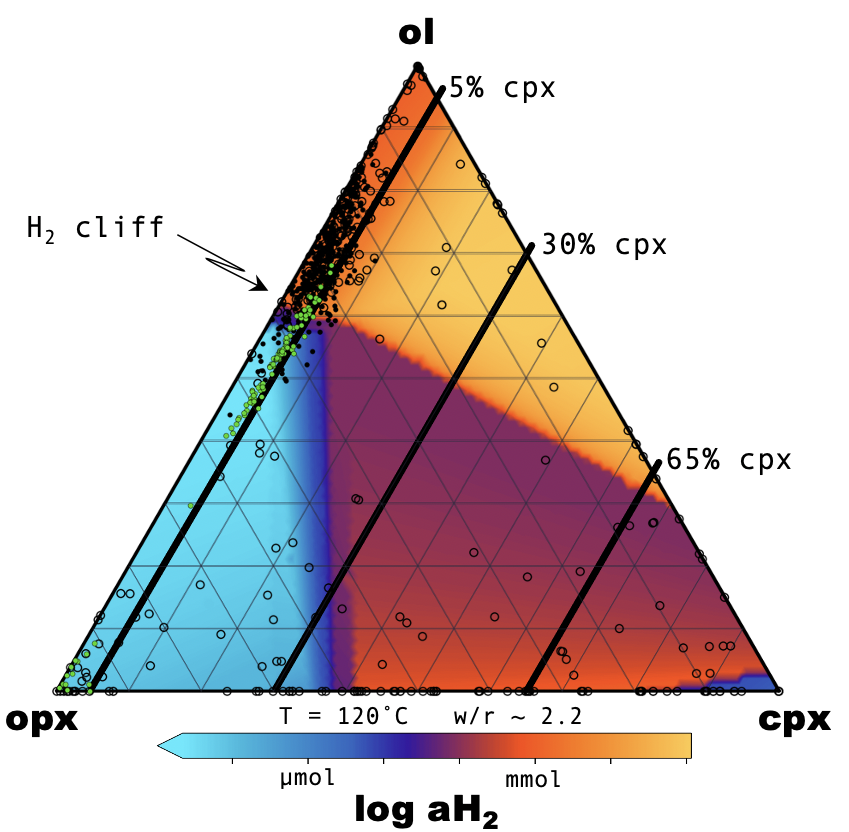

At 39 Alpha, we are more than just a team of geochemical modelers, physicists, and software developers. We are passionate problem solvers, dedicated to making a meaningful impact on the world by conducting research that has a postiive inpact on the enviornment, and by extension, humanity. Thats why 39Alphas [Team 0](/team) is developing novel research approachs in anticipation of ARPA-E’s hydrogen generation initiative.

With our scientifically diverse skill set and extensive experience modeling geologic H2 generation, we bring a unique and comprehensive perspective to the table. We specialize in providing high-throughput equilibrium and out-of-equilibrium geochemical modeling, enabling us to guide engineers in discovering optimal water-rock system for H2 generation. By analyzing and interpreting chemical models that span large ranges of the dependent variable space, we can identify the right conditions for hydrogen generation, a process that would traditionally be time-consuming and expensive in the lab or the field.

    
... in progress ...

As we compete for the prestigious ARPA-E grant focused on Geologic Hydrogen, we firmly believe that we are the ideal fit to help address this critical challenge.

Team 0 is intersted in being a part of this initiative, lending their geochemical modeling prowess,
code development skills, creativeity, and outside-the-box thinking to an initiative aimed at
reducing the cost and carbon footprint of a clean, geology-derived energy source. Hydrogen.

When water interacts with naturally occuring mienrals in the environemnt, dihydrogen (H2) can be
generated. But only sometimes, and only under certian conditions. Some of these minerals and
conditions are known (citations). However, Team0 can quickly and efficiently search for novel
mienrals and moineral/combinations, across vast expanses of the conditions that might be suitable for 
engineered approaches. 

designing a research porject that will calucalate which naturally occurming mienrals generate H2 and under which conditions. 

Similar work, recently published by Team0 member Tucker Ely (link) explored how Ultramafic rocks
beneath the Earth's seafloor do just this, quantifying how smooth changes in rock compsotions and
reaction conditions generate a vast diversity of H2 concentrations.

Geologic H2 generated in this way is clean, avoiding the enviornemtnal side effects of carbon-based
fossil feuls.

We are intersted in which combinations of mienrals are ideal for H2 generation, and determineing
those that are most effective at the lowest cost, and where those minerals might naturally occur

Now,

1. ideal for H2 generation
2. most inexpensive to harness
3. where souch conditions might be naturally located, emplced, and built.

Which minerals, under which conditions, yield H2 at what concentrations?

Talk about 3 novel approaches we are developing

Now Team0 has decided to get creative, developing novel approaches to H2 generation from geologic
sources. Team0 is actively looking for collaborators in their proposals to ARPA-E.

1.
2. 

end with call to action (contact us!)
